# Control and hierarchy refinement

This follow-up preserves the approved charcoal and mint design while correcting interaction defects and making the workspace easier to operate.

## Changes

- Removed Import graph and the promotional canvas headline. Graph controls occupy the released toolbar space.
- Moved the inspector toggle to the graph's right edge, beside the inspector. The inspector also has a close control on desktop.
- Enlarged controls and strengthened the hierarchy between function names, section titles, explanations, and technical metadata. Missing summaries no longer occupy a large placeholder card.
- Added a full-canvas gradient behind the dot grid. The entrance sweep is a separate effect.
- Kept graph orientation and node coordinates stable across collapse/reopen, selection, search, Show all, and trace startup. Explicit Reset is the operation that rebuilds the layout.
- Preserved button icons during label changes, explained unavailable traces, and kept Pause usable during an animated step.

The original failure combined a horizontal initial graph layout with vertical incremental placement. The previous automated checks did not cover the full collapse/reopen journey. New regression tests and repository-specific review instructions cover that gap and startup after optional control markup is removed.

## Verification

All 20 viewer regression tests pass. Chrome checks on the deployed preview verified exact node-coordinate preservation through collapse/reopen, background deselection, Show all/Hide all, and search. Zoom, Fit, all four filters, address search, inspector open/close, connection links, source disclosure, Pause, Step, Reset, speed, and Follow node were exercised through their visible controls.

The final responsive checks include 1440px desktop, 1280 × 720 playback, and 390px and 320px mobile layouts. The inspector toggle is 20px from the desktop panel boundary. The graph background covers 100% of its canvas. Playback controls stay within the canvas at 720p, and mobile dialogs retain focus and dismiss with Escape.

## Before and after

These are actual Chrome captures of the deployed viewer, with the same keychecker graph. The original redesign gallery remains in [UI_REDESIGN.md](UI_REDESIGN.md).

| Area | Before | After |
| --- | --- | --- |
| Desktop workspace | 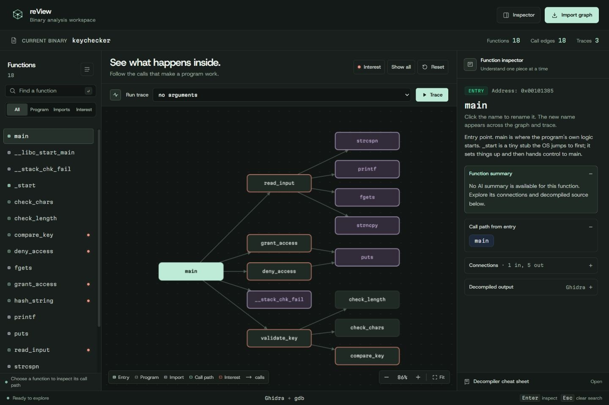 | 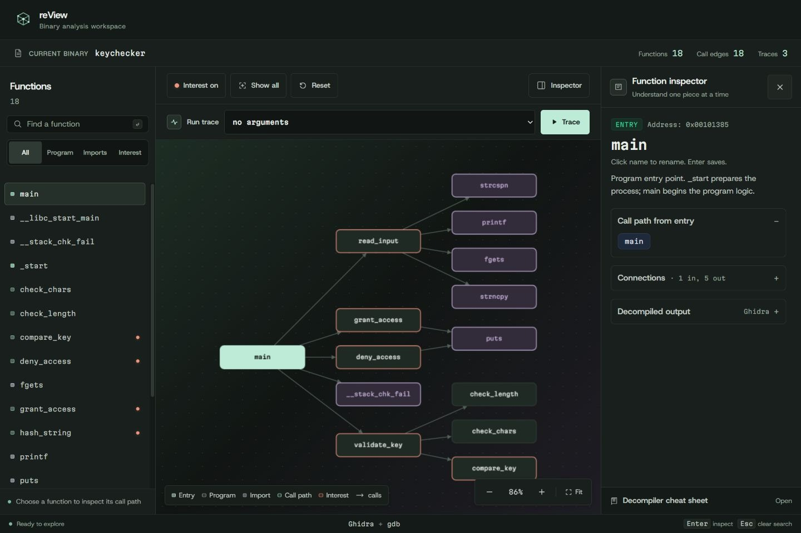 |
| Controls and inspector toggle | 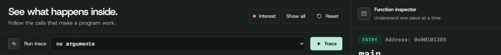 | 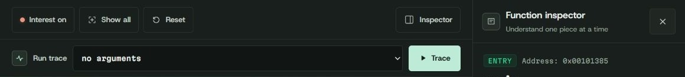 |
| Function inspection | 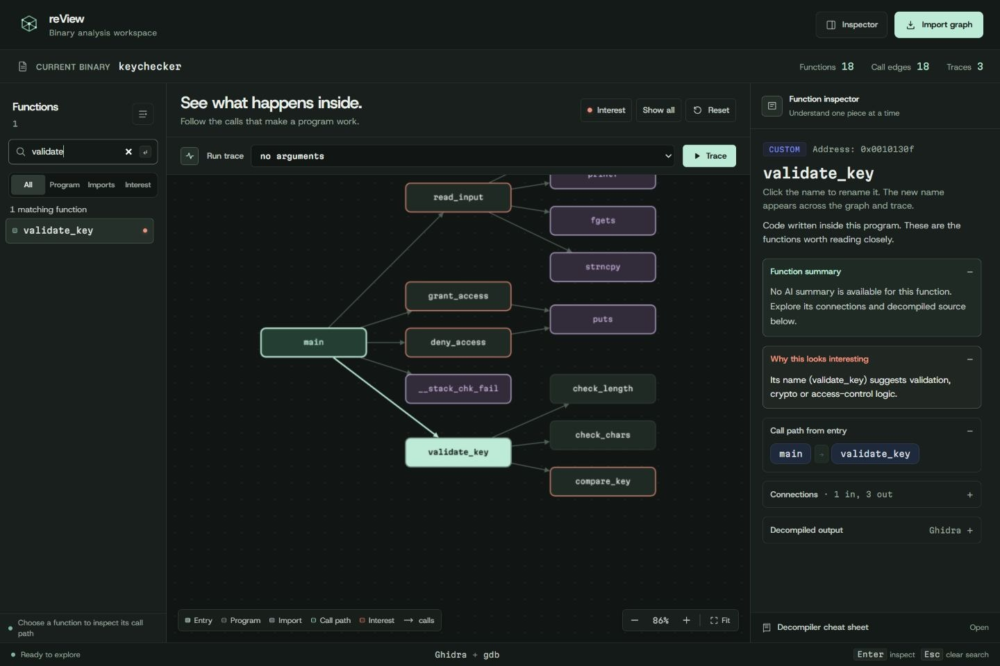 | 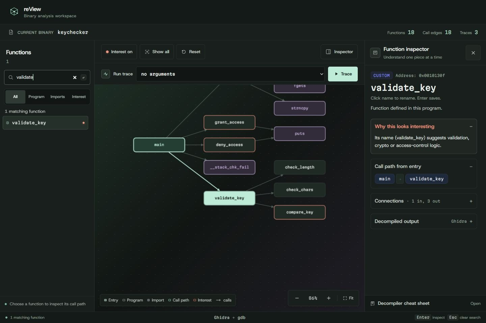 |
| Inspector hierarchy | 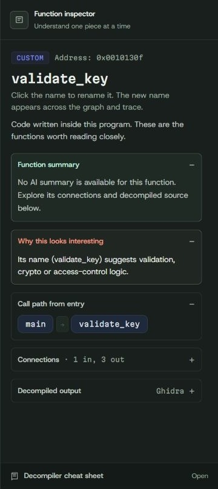 | 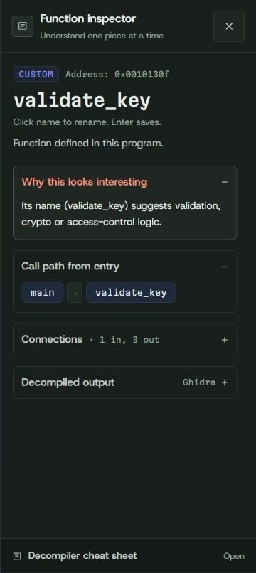 |
| Mobile controls | 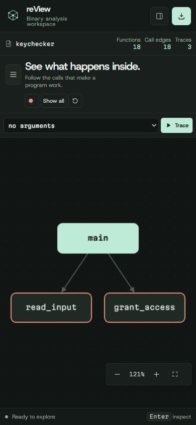 | 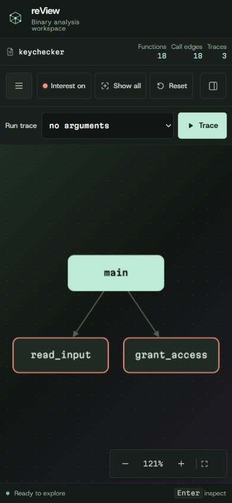 |

| 720p trace playback | 320px mobile layout |
| --- | --- |
| 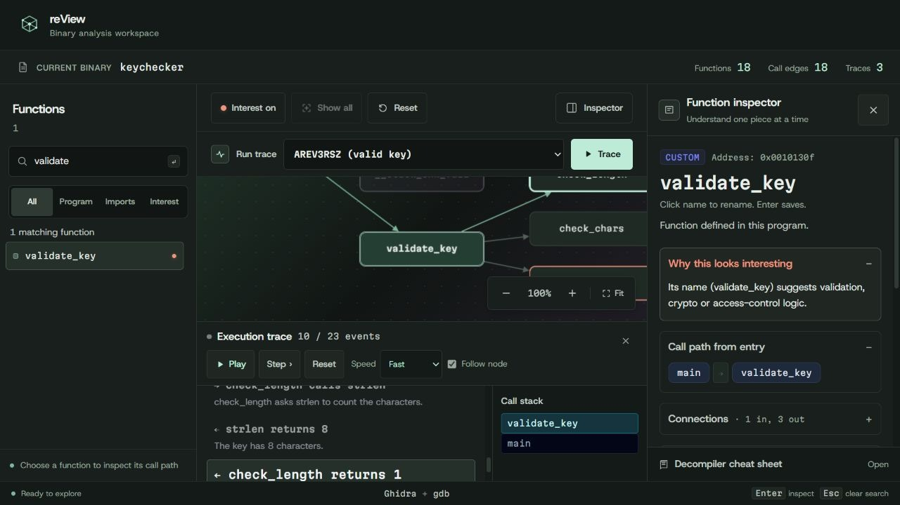 | 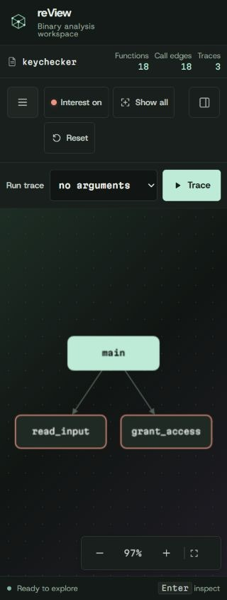 |

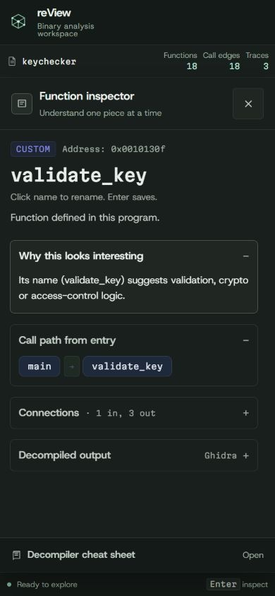

[Try the verified static demo](https://review-redesign-demo.vercel.app/keychecker/). The deployed viewer payload is revision `92b2dad289e3486ab08a10fec8ff0d1f2d05bf22`.

The Python backend, analysis pipeline, graph datasets, and viewer copy contract are unchanged. Live GDB execution requires the original backend; the static review demo supports recorded and simulated traces.
