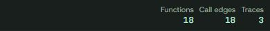

# Graph statistics header

Removed the inaccurate Current binary name, which was inferred from the hosting URL. Functions, Call edges, and Traces remain in the same header with their existing live counts and styling. Removed unused identity styles and URL/filename inference. Backend and graph data are unchanged.

| View | Before | After |
| --- | --- | --- |
| Desktop |  |  |
| Mobile |  |  |

Validation: JavaScript syntax and all 20 existing viewer regression tests pass. Deployed Chrome verification checks the retained counts, removed label, and responsive fit.

[Review demo](https://review-redesign-demo.vercel.app/keychecker/)
