# reView interface redesign

The viewer is now a charcoal and mint analysis workspace with a searchable function navigator, a graph canvas, and a persistent desktop inspector. The graph itself supplies the main visual: color communicates function state and animated execution follows real call relationships.

[Open the review demo](https://review-redesign-demo.vercel.app/keychecker/). It serves the existing keychecker graph and supports recorded and simulated traces. Live binary execution still requires the original local backend.

## Before and after

These are actual Chrome captures of the original viewer and redesigned viewer using the same keychecker dataset. The desktop captures use a 1440 × 960 viewport unless noted. JPEG compression keeps the review gallery small. Motion was reduced for settled captures; animation was also tested separately.

| Area | Before | After |
| --- | --- | --- |
| Workspace and graph | 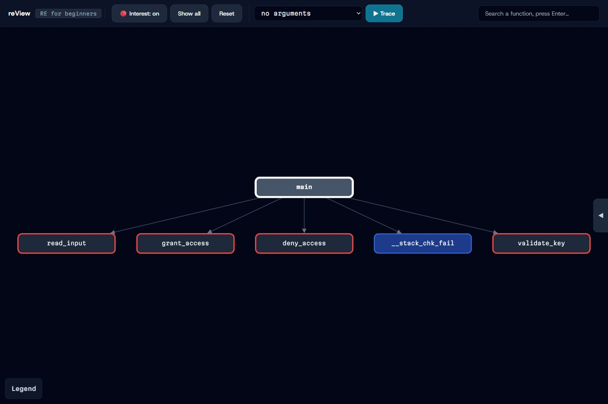 | 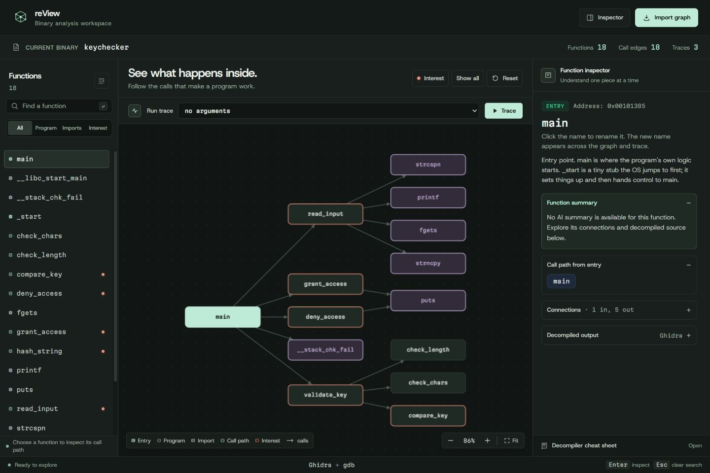 |
| Function inspector | 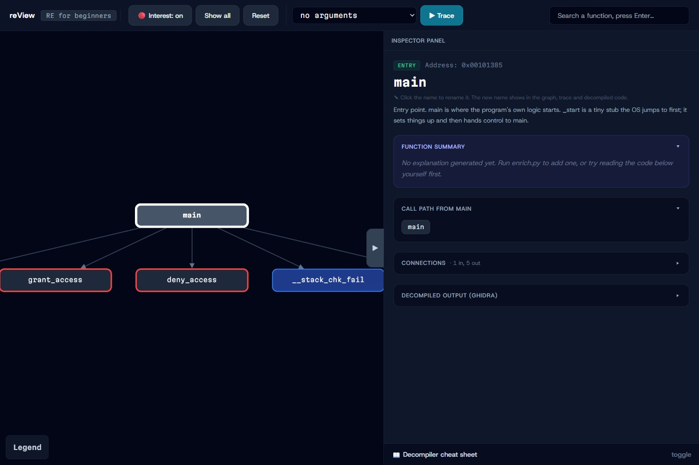 | 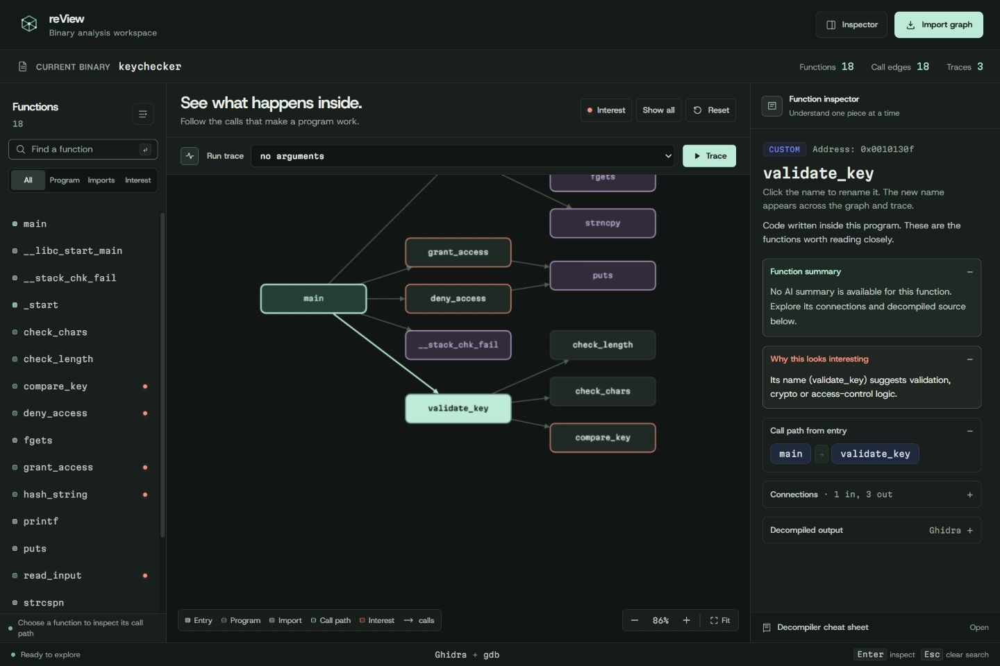 |
| Inspector detail | 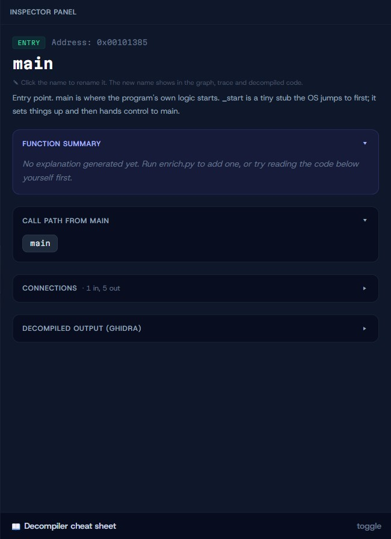 | 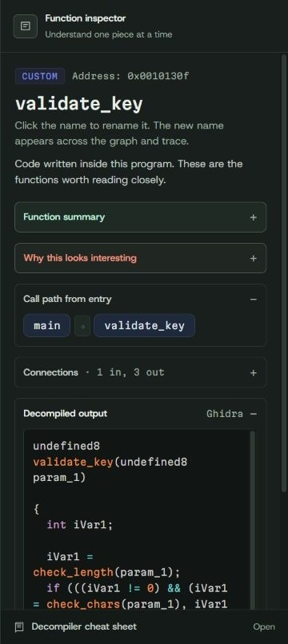 |
| Execution playback | 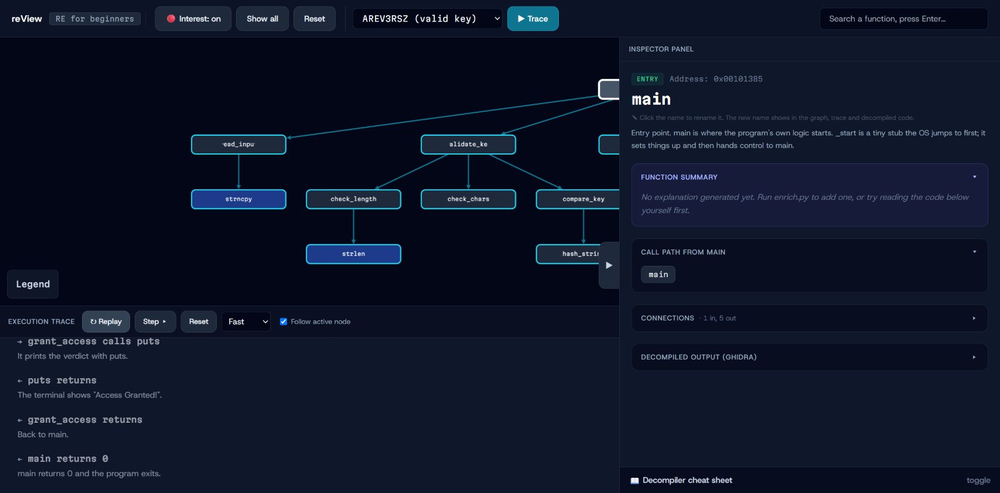 | 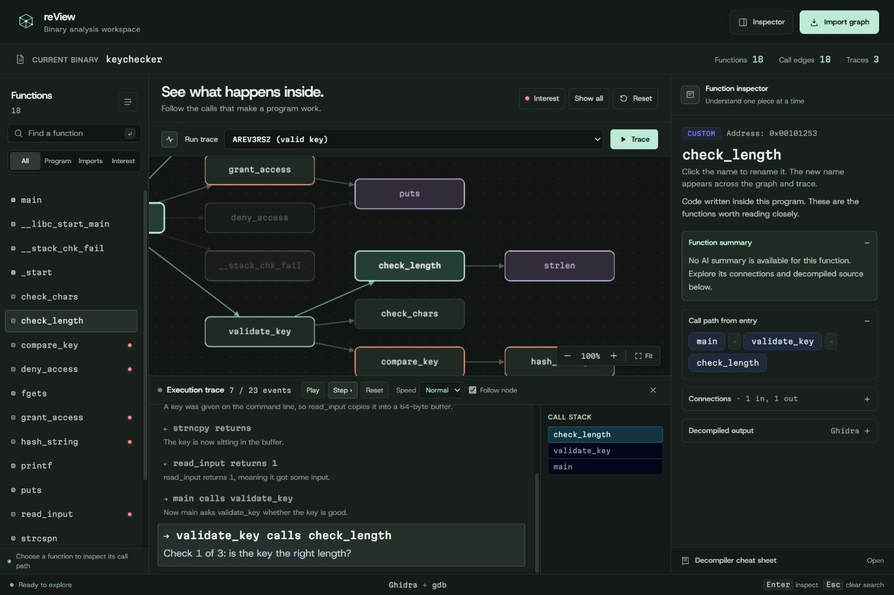 |
| Trace controls and log | 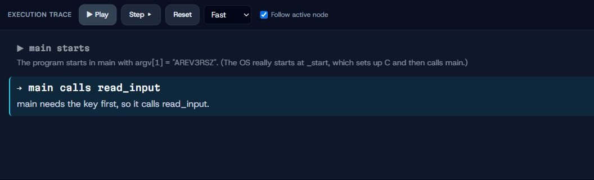 | 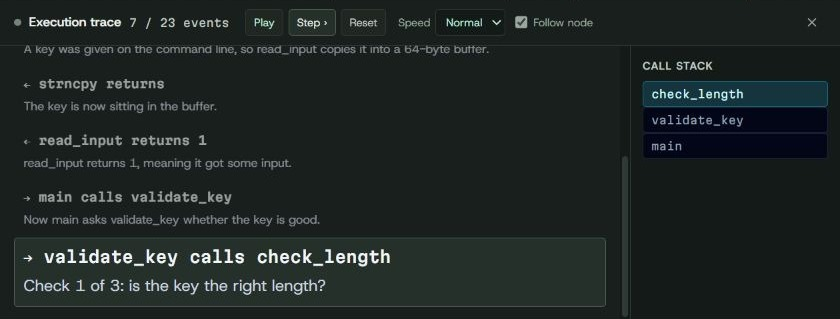 |
| Header and controls |  | 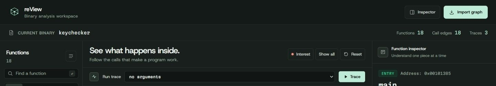 |
| Mobile, 390 × 844 | 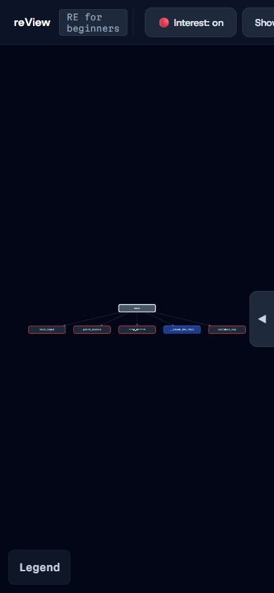 | 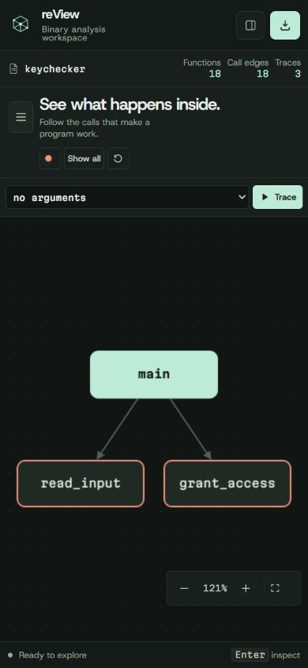 |

## Additional views

| Source inspection | Completed execution |
| --- | --- |
| 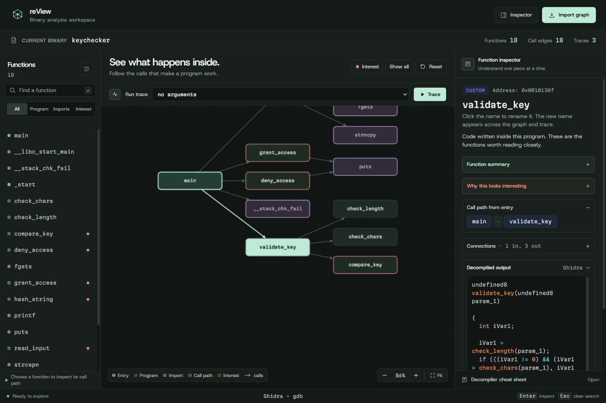 | 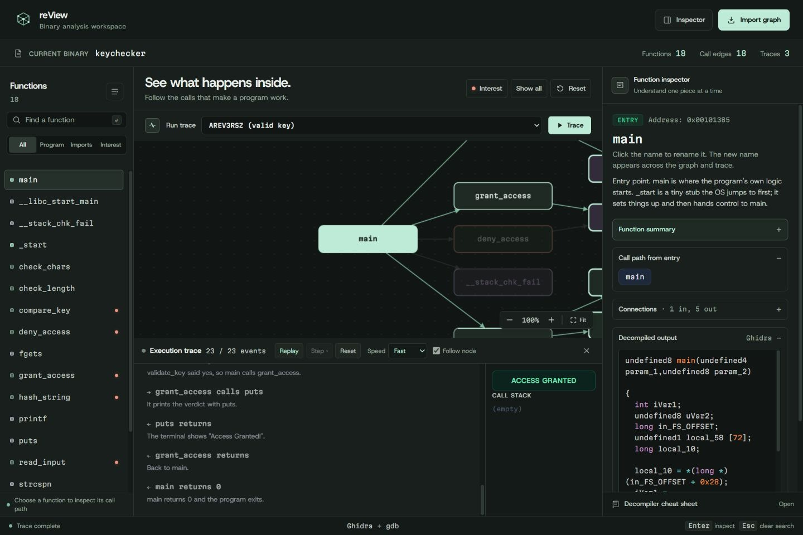 |

| Mobile function navigator | Mobile inspector | Compact 320px viewport |
| --- | --- | --- |
| 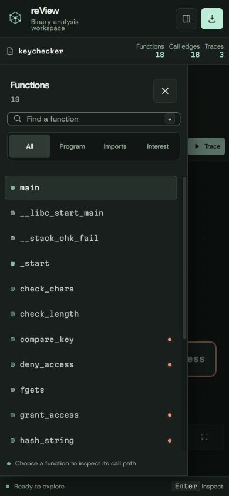 | 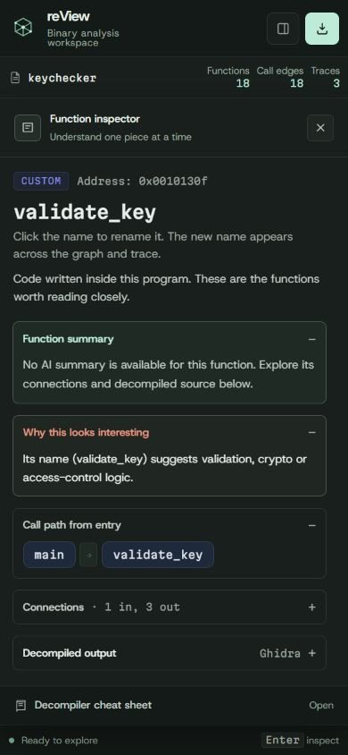 | 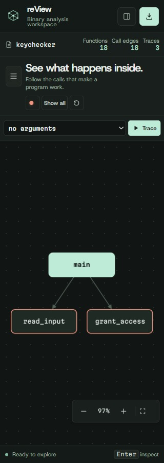 |

## Interaction and motion

- Search by function name or address, filter by function kind, and press Enter to focus a result. `/` focuses search, `F` fits the graph, and Escape dismisses overlays.
- Explore graph connections, zoom, fit, inspect decompiled C, and rename functions with the existing local persistence behavior.
- Trace playback includes play, pause, step, reset, speed, call stack, and a progress log. Follow node keeps the active function legible; disabling it restores an overview.
- A restrained canvas entrance and moving execution token add motion. Reduced-motion preferences disable camera and layout transitions.
- Below 1100px, navigation and inspection become dismissible dialogs with contained keyboard focus. Below 600px, the graph uses a compact vertical layout.

## Verification and scope

The automated viewer suite covers graph validation, filtering, interrupted trace playback, reduced motion, follow-camera behavior, dialog focus, and the existing live API request contract. All 11 tests pass.

Browser checks cover import, search, filters, selection, source inspection, persistent renaming and restoration, trace play/pause/step/reset, successful simulated execution, zoom/fit, and responsive layouts from 320px through desktop. The deployed static demo is checked against the local payload hashes.

The Python backend, analysis pipeline, API routes, graph data, and three-file viewer copy contract remain unchanged. End-to-end live GDB execution was not run on this Windows host. The original CDN dependency loading remains in place.

See [DESIGN.md](../DESIGN.md) for the implemented visual system and the [preview ledger](../.codex/task-ledgers/preview-redesign.md) for ownership and teardown information.
